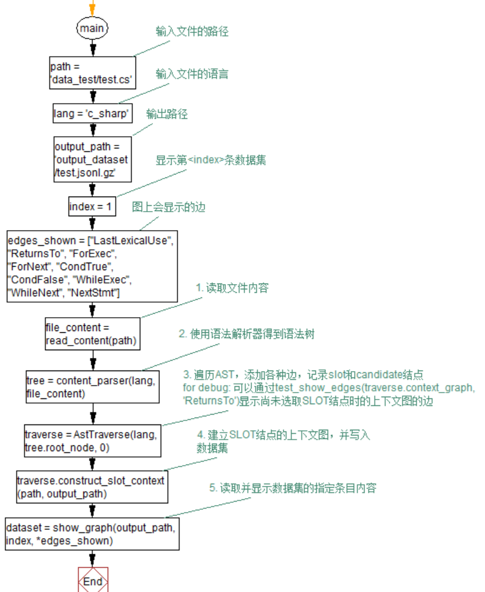

# 仓库说明

本仓库是2022年暑假实习项目，具体完成的任务为：学习《Learning to Represent Programs with Graphs》代码中生成图文件的解析代码、《Detecting Code Clones with Graph Neural Networkand Flow-Augment Abstract Syntax Tree》论文中边的构造，将各种边的构造方法总结成文档，并翻译成python代码。

## 开始使用

版本要求：

```bash
python >=3.9
pip >= 22.2.1
tree_sitter >= 0.20.0
pyvis >= 0.2.1
```

若安装了Anaconda，可以运行如下指令：

```bash
conda create -n 名字 python=3.9
pip install requirements.txt
python main.py
```

## 仓库中的文件的说明

```bash
│  .gitignore 
│  README.md
│  requirements.txt  # python库要求
│  main.py
│  content_parser.py   # 调用tree_sitter解析代码内容
│  context_graph_edges.py  # 生成边
│  dfg.py  # 生成DFG边
│  dfg_utils.py  # 被dfg.py调用
│  show_data.py  # 可视化显示数据集某一条
│  test1.html  # 示例输出（可视化结果）
├─data_test  # 示例输入（C#和python的）
│  │  main.py
│  │  test.cs
│  │  test.py
│  └─TestProject
├─output_dataset  # 示例输出（数据集）
│  │  test.json.gz
├─documents  # 文档合集
│  │  已生成的边的构造方法.md
│  │  未生成的边的概念.md
│  │  遇到的问题和难点.md
├─paper1_DataExtraction  # 第一篇论文团队提供的数据集提取代码
├─papers  # 目标阅读的论文
│  │  Learning to Represent Programs with Graphs.pdf
│  │  Detecting Code Clones with Graph Neural Networkand Flow-Augment Abstract Syntax Tree.pdf
├─tree_sitters  # tree_sitter的各语言的写法
│  │  my-languages.so
│  ├─tree-sitter-c
│  ├─tree-sitter-c-sharp
│  ├─tree-sitter-cpp
│  ├─tree-sitter-go
│  ├─tree-sitter-java
│  ├─tree-sitter-javascript
│  ├─tree-sitter-php
│  ├─tree-sitter-python
│  └─tree-sitter-ruby
└─__pycache__  # pycharm的临时文件
```

代码文件的主要调用关系：

```bash
├─main.py
│  ├─content_parser.py
│  │  │  tree_sitters/my-languages.so
│  ├─context_graph_edges.py
│  │  ├─dfg.py
│  │  │  │  dfg_utils.py
│  │  show_data.py
```

输入的测试代码文本在`data_test`文件夹下，输出的数据集在`output_dataset`文件夹下，输出的可视化html文件在根目录下。

## 主要运行流程



