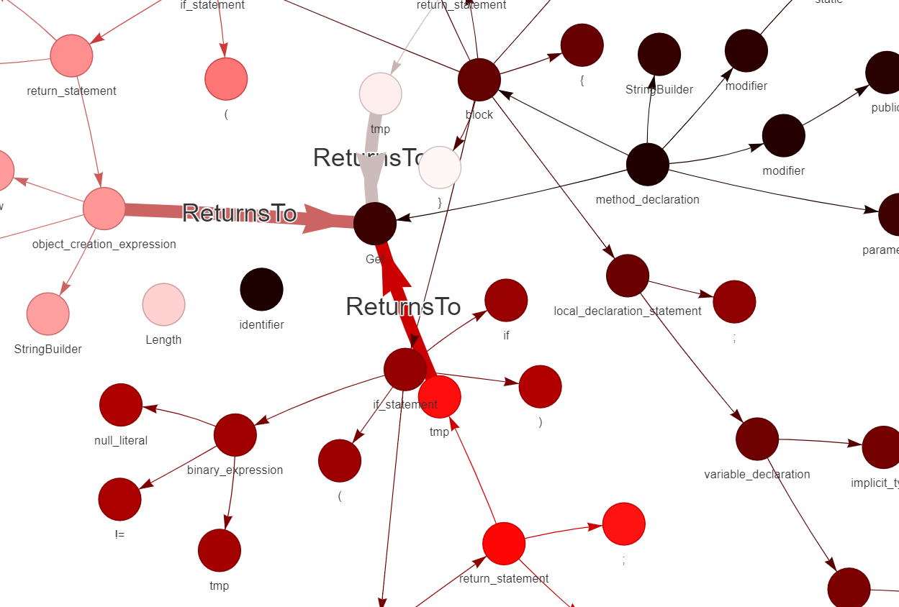

# 已生成的边的概念

第一篇论文：

```perl
Child edges：AST中的父节点→子节点。
NextToken edges：用来记录tokens的顺序，token→下一个token；（token就是源代码中具有语法含义的最小单位）
ComputedFrom edges：用于记录表达式中变量的计算关系。表达式左侧变量→表达式右侧中的变量。
LastLexicalUse edges：变量节点→变量上次以同一种词法使用方式使用的节点。如额外添加的candidate→原节点。
ReturnsTo edges：返回值节点→方法/函数声明节点。
```

第二篇论文：

```perl
CondTrue、CondFalse：为AST中Condition到ThenStatement添加CondTrue，为Condition到ElseStatement添加CondFalse。
WhileExec、WhileNext：为AST中Condition到While循环体添加WhileExec，为While循环体到Condition添加WhileNext。
ForExec、ForNext：为AST中Condition到For循环体添加ForExec，为循环体到Condition添加ForNext。
NextStmt：为块执行体中的语句添加NextStmt边，如下图中的Body，就是块执行体。
```

其他的：

```perl
ComesFrom: 时包含了第一篇论文需要的LastUse、LastWrite、GuardedBy、GuardedByNegation边的语义。
```

# 已生成的边的构造方法

第一篇论文：

- Child edges：前序遍历语法树，并添加父节点→子节点。
- NextToken edges：前序遍历语法树，遇到叶子结点时添加“上一个token结点”→“下一个token”，并更新“上一个结点”为当前叶子结点。
- ComputedFrom：前序遍历完成、添加了Child和NextToken结点后，通过调用dfg.py添加ComputedFrom边。
- LastLexicalUse：前序遍历到叶子结点、添加candidate结点的时候，添加该边使candidate结点→语法树中的原结点。[示例与ComesFrom边一起]

- ReturnsTo：后序遍历时，遇到return_statement类型结点时，添加返回值节点→方法/函数声明节点，如果没有返回值结点，则添加return_statement结点→方法/函数声明结点。

第二篇论文：

- CondTrue、CondFalse：第一个非关键词或符号的结点记为条件结点，第二个记为CondTrue，后面的记为CondFalse。

- WhileExec、WhileNext：和if差不多。第一个非关键词或符号的结点记为条件结点，第二个记为循环体。

- ForExec、ForNext：条件要考虑分号的位置。具体实现如下：

  示例图如下：

- NextStmt：上一个非关键词或符号的结点→非关键词或符号的结点。只要先跳过关键词和符号的语句，然后记录结点并加边即可。

其他边：

- ComesFrom：上次出现的位置→当前变量节点。且对于一个表达式中左侧出现的变量节点，有这样的添加规则：表达式右侧节点→表达式左侧变量节点。